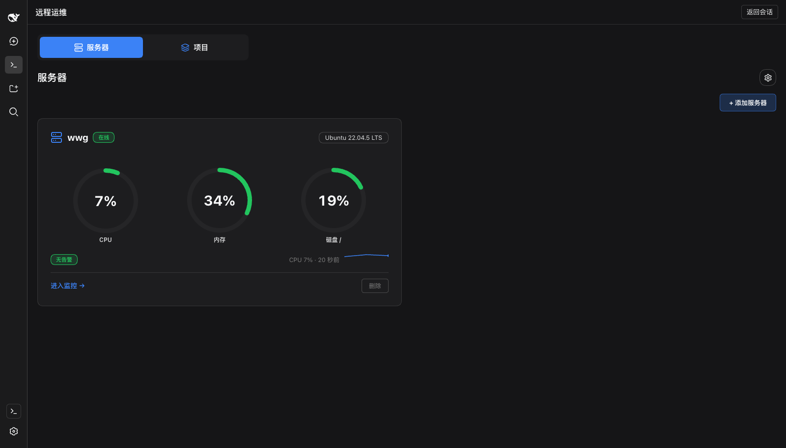
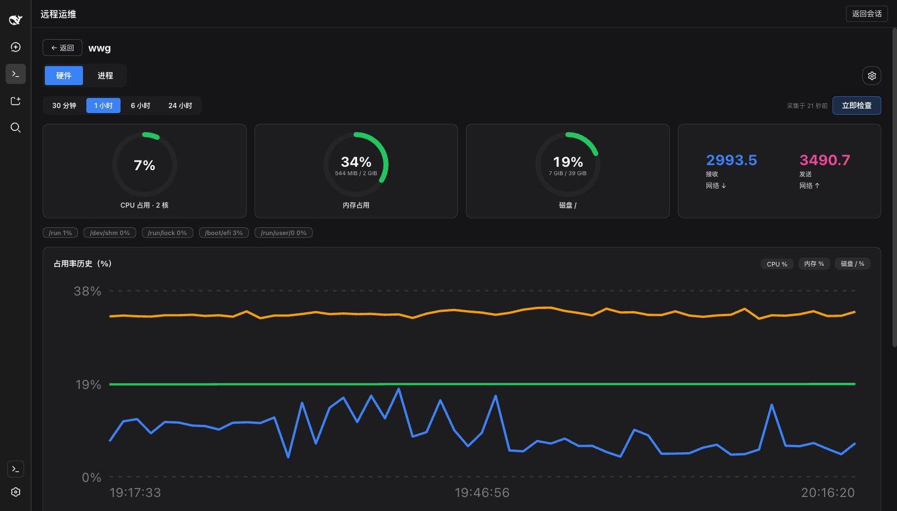
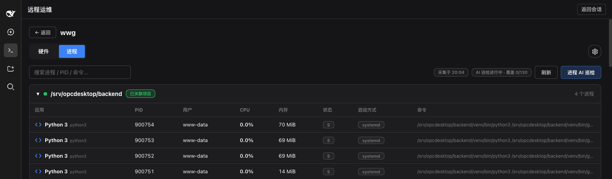
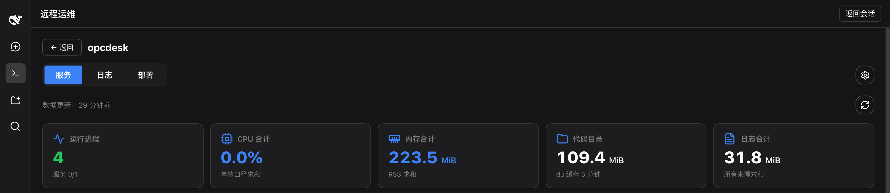
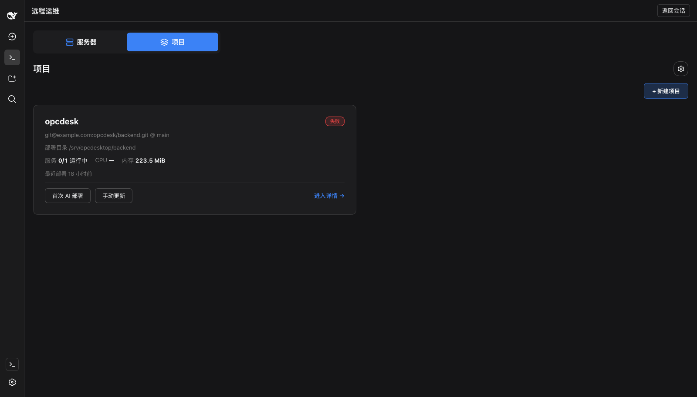

<div align="center">

# dsh-devops

**Server operations inside the DSH Web app: SSH server management · hardware / process / log monitoring · AI inspection · a Git deploy loop**

[English](./README.md) · [中文](./README.zh.md)

[](LICENSE)
[](https://github.com/deepseek-ai/deepseek-harness)
[](#features)
[](#development-and-testing)
[](https://github.com/topics/dsh-plugin)

</div>

---

## What this is

dsh-devops is a [DeepSeek Harness](https://github.com/deepseek-ai/deepseek-harness) (DSH) Web
plugin. Without leaving the chat view or opening a separate terminal, you open **Remote
Operations** from the DSH sidebar to add SSH servers, watch hardware and processes, have the AI
inspect logs and process anomalies on a schedule, and deploy a Git repository to a server and
restart its services.

The core of it is a **deploy loop**:

1. **First AI deploy** — pick a Git repository, a branch and a target server. The AI works over
   SSH through environment checks, dependency install, build, service start and health
   verification.
2. **Script consolidation** — after a successful deploy, the reusable steps are frozen into
   versioned `.sh` scripts (`candidate → verified → invalidated`, hash-pinned against tampering),
   so one-off environment work and routine updates are handled separately.
3. **One-click update** — later deploys run `git pull --ff-only` on the server (fast-forward
   only, no surprise merges or rebases). Frozen steps run their script, unfrozen steps fall back
   to the AI, and a failure is retried after AI-assisted repair (2 rounds by default).

> Inspection is always read-only: the AI analyses and recommends, it never repairs or restarts
> anything on its own. That boundary is enforced structurally by tool permissions, not by prompt
> wording.

## Screenshots

| Server overview | Hardware monitoring |
| --- | --- |
|  |  |

| Process groups and AI inspection | Project service detail |
| --- | --- |
|  |  |

**Projects**: multiple projects, repositories and deploy targets; a first AI deploy and a manual
update are both one click away.



## Features

### 🖥 Server management

- Add, edit and remove any number of SSH servers; a **real login test is mandatory before a
  server can be saved** — it has to execute a remote command unattended
- The host fingerprint is verified and stored on first connect; a changed fingerprint pauses the
  connection
- Plugin-private SSH config, fully isolated from system and user config; supports private keys
  and jump hosts
- Covers Linux (no distribution whitelist) and macOS, and labels capability as
  available / limited / unavailable with the reason when it is not

### 📊 Monitoring and AI inspection

- **Hardware**: CPU, memory and disk usage, collected on demand or on a schedule (60s default)
- **Processes**: no per-process setup — running processes are enumerated in full and grouped by
  project and service. The AI analyses resource and state anomalies in batches, names the
  specific process and the reason, and shows analysis coverage transparently (a partial analysis
  is never presented as normal)
- **Logs**: log sources are discovered dynamically along project → service → log file (for
  example by reading Supervisor's actually-effective config), read incrementally, with alert
  de-duplication. The AI flags anomalies and alerts with a level, a summary and locatable source
  evidence
- **Server-side execution**: closing the browser does not stop inspection; the DSH restart
  restores the inspection schedule without piling up catch-up runs

### 🚀 Project deployment

- Multiple projects, repositories and deploy targets; SSH, Git credentials and privilege
  escalation are configured and verified independently
- The first deploy is orchestrated by the AI, which fixes the health check up front (expected
  process, port, wait deadline) and refreshes log monitoring dynamically
- Later deploys: repository / branch reconciliation → `git pull --ff-only` → dependency update /
  build → service restart → health verification
- A dirty working tree, a branch mismatch or a diverged remote always stops and reports; it never
  overwrites automatically, and there is no dangerous bulk rollback
- Tasks are persisted end to end; an interrupted task is marked as such and cannot continue until
  the actual remote state has been reconciled

### 🛡 Security design

- Credentials (passwords, private keys, passphrases) are stored with **AES-256-GCM** encryption,
  with key material kept separate from configuration data
- Secrets are **redacted** before they are displayed, persisted, or placed into AI context;
  passwords never reach command lines, scripts or logs
- Remote commands go through a **whitelist parser**; inspection is a read-only boundary enforced
  by tool permissions rather than prompt wording
- RPC runs over the host's authenticated channel; the API layer validates every payload with zod
- **No install-time scripts**, no telemetry, and the plugin never holds a model API key of its own

## Quick start

### Requirements

- A DSH Web host that supports the `dsh plugin` mechanism — see [Compatibility](#compatibility)
  for the versions this was verified against
- An SSH client that can reach your target servers
- ⚠️ **Set `DSH_DEVOPS_KEY_FILE` before you save any credential** (see below)

### Install

Prebuilt on both paths — **you never run a build on your machine**:

```sh
# from npm (preferred: no build approval needed)
dsh plugin --profile web add @bigbigtooth/dsh-devops

# or from a prebuilt tarball
dsh plugin --profile web add https://github.com/bigbigtooth/DSH-DevOps-Plugin/releases/latest/download/dsh-devops-latest.tgz
```

You **must restart the host afterwards** — plugin bundles are loaded at boot, and `plugin add`
only writes the manifest:

```sh
pkill -f '\.bin/dsh --profile web'
sleep 2
nohup ~/.dsh/tooling/node_modules/.bin/dsh --profile web >> /tmp/dsh-web.log 2>&1 &
```

After installing, a **Remote Operations** entry appears at the bottom of the DSH sidebar, above
Settings. Click it to open the operations panel, and use "Back to conversation" to return to chat
at any time.

> For headless use, swap `--profile web` for `--profile headless`. The UI half of this plugin
> only exists under the web profile; inspection and deployment work in either.

### ⚠️ Three traps

1. **Set the key file first.** Without `DSH_DEVOPS_KEY_FILE` the plugin uses an in-memory key
   that is regenerated on every host start, so **stored credentials cannot be decrypted after a
   restart**:
   ```sh
   export DSH_DEVOPS_KEY_FILE="$HOME/.dsh-devops/master.key"
   ```
   The key file is written with mode `0600`. **There is no recovery path — lose the key file and
   the credentials are gone.**
2. **Reinstalling the same version is a no-op.** pnpm serves the same `file:` spec from cache, so
   remove before adding:
   ```sh
   dsh plugin --profile web remove @bigbigtooth/dsh-devops
   dsh plugin --profile web add @bigbigtooth/dsh-devops
   ```
3. **Restart the host.** See above.

## Permissions and side effects

The full disclosure is in **[SAFETY.md](./SAFETY.md)**. Summary:

| Item | Detail |
| --- | --- |
| Local files read | Only `<dataDir>` (default `~/.dsh-devops`) and the host storage domain `dsh_devops`. **Not** `~/.ssh`, not shell history |
| Remote files read | Hardware, processes, logs and the git working tree on the servers you add |
| Network egress | ① to your servers (SSH); ② to your configured model (inspection and deploy data). **No telemetry, no third-party endpoint** |
| API keys | The plugin holds **no** model API key of its own; it uses the host's LLM service |
| Write behaviour | Inspection is read-only; deployment writes only inside a task you explicitly created (`git pull --ff-only`, build, restart) |
| Conversation data | **Never read and never transmitted.** AI context is assembled from inspection and deployment material only |
| Install scripts | No `preinstall` / `install` / `postinstall` |

## Compatibility

DSH is entirely on rc and the maintainers state that breaking changes are expected. Align your
versions with this table:

| dsh-devops | DSH (harness) | Status |
| --- | --- | --- |
| 0.5.0 | 0.1.5-rc.2 | ✅ Verified (full test suite plus a real install) |
| 0.4.x | 0.1.5-rc.2 | ✅ Verified |

> The package was renamed from `dsh-devops` to `@bigbigtooth/dsh-devops` in 0.5.0 because the
> unscoped name on npm is reserved by someone else. 0.4.x remains installable from the
> `v0.4.0` release assets.

Check the host version with `dsh --version`. dsh-devops declares a **stable** range for
`@deepseek-ai/cordis` (`^4.0.1`; both are optional peers), so there is no prerelease triplet
matching problem. When the host moves to a new minor, upgrade this plugin first.

## Verify your install

There is no console exporter during install and `ctx.logger` only writes to an in-memory buffer,
so **neither logs nor exit codes are a verification signal**. The only hard evidence is that the
layer loads and that a real route answers:

```sh
# 1) Is the config layer present? (you should see a dsh-devops layer)
dsh --profile web --dump-config | grep -A5 'dsh-devops'

# 2) The host log should show no activation gate failure

# 3) Open "Remote Operations" after boot and add a server — the mandatory login test
#    actually executes a remote command, so its success is the real proof
```

## Configuration

The defaults below can be overridden through the cordis patch layer:

| Field | Default | Description |
| --- | --- | --- |
| `dataDir` | `~/.dsh-devops` | Private data directory (SSH config, keys, degraded storage) |
| `modelRef` | null | Model used for AI inspection and deploy steps; when empty, AI steps honestly report the capability as unavailable |
| `hardwareIntervalSeconds` | 60 | Hardware collection interval |
| `processIntervalSeconds` / `logsIntervalSeconds` | 300 | Process / log AI inspection interval |
| `retentionDays` | 30 | Retention for ordinary history (config and valid scripts are not pruned) |
| `batchBudgetTokens` | 8000 | Per-batch AI input budget |

The `DSH_DEVOPS_KEY_FILE` environment variable points at the credential master key file
(see trap 1 above).

## Install from source

```sh
git clone https://github.com/bigbigtooth/DSH-DevOps-Plugin.git
cd DSH-DevOps-Plugin
pnpm install
pnpm build && pnpm pack --pack-destination dist

dsh plugin --profile web remove @bigbigtooth/dsh-devops   # required before reinstalling the same version
dsh plugin --profile web add ./dist/bigbigtooth-dsh-devops-*.tgz
```

Installing from Git means you build it yourself — git installs do not run build scripts.

## Development and testing

```sh
pnpm typecheck            # strict types (host / client / tests)
pnpm test:unit            # contracts / SSH / vault / repository / execution / probes / inspection / logs / scheduler / scripts…
pnpm test:contract:dsh    # real cordis runtime lifecycle + restart persistence
pnpm test:integration:ssh # private config / askpass / fingerprint / execution / stop
pnpm test:integration:ops # real git repository deploy pipeline
pnpm test:e2e:web         # full path + counterexample matrix
pnpm test:acceptance      # executable subset of the product acceptance suite
pnpm test                 # everything
```

The SSH and deployment integration suites run against an in-process fake, so no real server is
needed. See [CONTRIBUTING.md](./CONTRIBUTING.md).

## Architecture (single Host / Client bundle)

```
src/contracts/    DTO schemas, error codes, deploy state machine, API contracts (shared by both sides)
src/host/
  adapters/       ports + DSH / file / memory adapters (business logic depends on no SDK)
  repository/     versioned records, migration backups, atomic claim, requestId idempotency
  vault/          AES-256-GCM credential envelope, redaction
  ssh/            command whitelist parser, private config generation, OpenSSH transport (private askpass channel)
  execution/      identified remote execution units (intent first, fact file, stop reconciliation)
  probes/         hardware / process collection (Linux + macOS parsers, missing fields are null, not 0)
  agents/         restricted AI inspection (batched, coverage-tracked, evidence verified server-side)
  logs/           Supervisor discovery, dual cursors, incremental reads, alert de-duplication
  scheduler/      persistent scheduling (single-flight coalescing, no catch-up, jitter, AI concurrency cap)
  deployment/     git precheck, ff-only update, first-deploy orchestration, repair (≤2 rounds), recovery, reconciliation
  scripts/        candidate → verified → invalidated (hash-pinned, applicability fingerprint)
  api/            zod-validated RPC dispatch (/rpc/dsh-devops on the authenticated channel)
src/client/       slots entry + large-card page modules (servers / projects + their detail pages) + charts + state model
```

<details>
<summary>Integration notes (for plugin authors building on this)</summary>

- When a patch row declares no `config`, the plugin receives `undefined` (not `{}`), so `Config`
  must fall back with `.prefault({})` or the whole plugin tree fails to boot.
- Host service names and storage names have syntactic constraints: services must be read through
  `ctx.get(name)`; domain and table names must match `^[a-z][a-z0-9_]*$` (`dsh-devops`→
  `dsh_devops`, `inspectionRuns`→`inspection_runs`), mapped at the adapter boundary.
- On unload, multiple async disposers run **concurrently** (reverse registration order, but with
  no serial-completion guarantee). Cleanups with an order dependency must be merged into a single
  disposer returned by **one** `ctx.effect`, awaiting them serially.

</details>

## Documentation

- [Product design (PROD)](docs/PROD.md) — product goals, requirements and design defaults
- [Implementation plan (PLAN)](docs/PLAN.md)
- [Host integration (INTEGRATION)](docs/INTEGRATION.md) — integration decisions and design notes
- [Acceptance status (ACCEPTANCE)](docs/ACCEPTANCE.md) — acceptance results and compatibility matrix
- [Safety and disclosure](SAFETY.md) / [安全与行为披露](SAFETY.zh.md)
- [Contributing](CONTRIBUTING.md) / [贡献指南](CONTRIBUTING.zh.md)

## License

[MIT](LICENSE)
