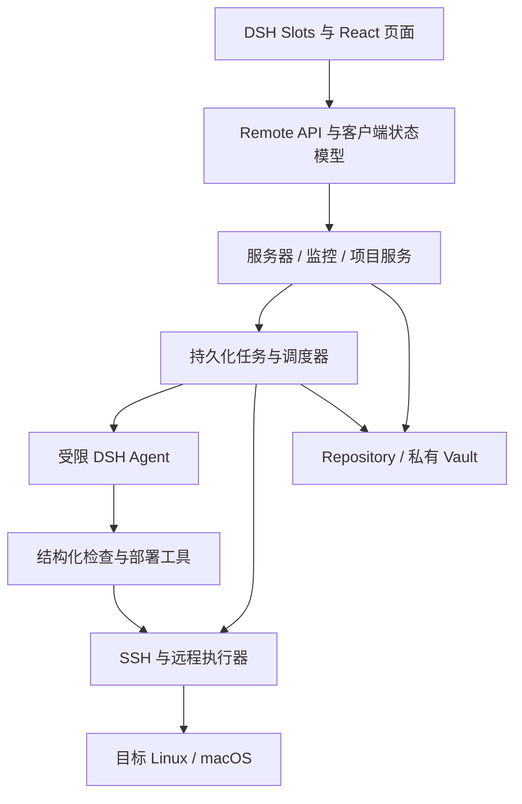

# DSH DevOps 开发计划

> 版本：v1.0｜日期：2026-09-17｜依据：[PROD.md v1.1](./PROD.md)。本文是待执行的开发方案；下文目录、接口、命令和测试均为计划产出，不代表已经实现或通过验证。

## 1. 开发目标与已核实的宿主能力

交付一个可安装到 DSH Web 的插件：在侧栏“设置”上方进入服务器、监控和项目运维页面；使用私有 SSH 配置管理 Linux/macOS 服务器；提供默认硬件、进程与动态日志监控；实现“首次 AI 部署成功 → 固化可复用脚本 → 后续手动更新、重启与有限自动修复”。

当前工作区只有文档，没有应用代码、依赖或测试。开发从宿主接入验证开始；不在第一步就并行铺开所有业务模块。仓库当前被上级 Git 工作区包含，初始化工程时先明确本项目的 Git 边界，保护上级目录的已有改动。

### 1.1 官方文档核对结果

| 能力 | 文档已经确认 | 本项目的落地方式与待验证项 |
| --- | --- | --- |
| 后端插件 | TypeScript `apply(ctx)`、依赖注入和副作用清理 | 独立插件包；由 `ctx.effect()` 管理本插件的连接、调度器和退出处理。[基础教程](https://deepseek-harness.github.io/deepseek-harness/develop/basic/) |
| 安装分发 | `dsh.bundle` 与 patch 组成可安装 bundle | 使用预构建包；固定经过验证的 DSH 版本，不把最新主分支当兼容承诺。[打包文档](https://deepseek-harness.github.io/deepseek-harness/develop/basic/publish) |
| 浏览器插件 | `dsh.client`、`./client` 导出参与客户端模块加载 | Host 与 Client 分别构建；核对外部插件的构建和依赖解析。[Client Modules](https://deepseek-harness.github.io/deepseek-harness/reference/subsystems/client-modules) |
| UI 扩展 | `ctx.slots.inject/register`；树中存在 `sidebar.footer.action` | 以该 slot 为入口候选；准确排序、页面容器和恢复导航必须运行验证，不能把右侧 Sidebar API 当左侧入口。[Slots](https://deepseek-harness.github.io/deepseek-harness/reference/subsystems/slots) |
| 前后端通信 | Typert Remote 提供带校验的服务调用，复用 Connection | 优先使用原生 Remote；验证树外包生成 Host/Client 产物和挂载自己的 namespace，不能直接复制宿主内部构建假定。[API Gateway](https://deepseek-harness.github.io/deepseek-harness/reference/api-gateway) |
| 后台 agent | `ctx.agents.create/resume` 返回受所有权管理的句柄 | 用服务端任务拥有独立 agent，不绑定当前聊天；验证工具隔离、模型选择及卸载行为。[Agent 核心](https://deepseek-harness.github.io/deepseek-harness/reference/subsystems/core) |
| 工具 | `defineTool` 与 `ctx.tools.register` 支持类型化工具 | 注册本插件的结构化巡检和部署工具，不给巡检 agent 通用写入 shell。[Tool 教程](https://deepseek-harness.github.io/deepseek-harness/develop/basic/tool) |
| 持久化 | `ctx.storageDomain` 提供领域存储，提交后发出变更通知 | 业务通过 Repository 使用宿主领域存储；单记录原子写、并发与版本迁移需做验证，不假设存在跨表事务。[Storage](https://deepseek-harness.github.io/deepseek-harness/reference/subsystems/storage) |
| 凭据 | 宿主提供凭据引用、解析及“已配置”描述接口 | 模型凭据沿用 DSH；SSH/Git/提权凭据由插件私有 Vault 管理。不能把“存在凭据服务”直接等同于满足加密落盘要求。[Credentials](https://deepseek-harness.github.io/deepseek-harness/reference/subsystems/credentials) |

以上消除了“宿主是否有这些扩展机制”的信息缺口，但没有替代真实集成测试。PROD 第 6 节的验证要求在 S0 落实。

## 2. 总体设计与公共契约

### 2.1 分层与职责

采用一个可分发 bundle、Host/Client 两个构建入口；先按业务模块组织，不提前拆成多个独立 npm 包。



- **Host 是业务状态的唯一写入方**：页面不直接执行 SSH，不保存密码，不用浏览器定时器运行巡检。
- **Agent 提建议和调用获准工具，编排器决定状态**：自然语言“部署成功”不能替代退出结果、阶段记录和健康检查。
- **采集与分析分开**：完整采集记录可先显示；AI 结果关联同一个快照，独立记录覆盖率和失败原因。
- **首版每个数据目录只允许一个活动控制器**：同一服务器的部署串行。跨实例同时管理同一目标不属于首版支持范围，检测到已有任务占用时拒绝重入。
- **远端无常驻业务 agent**：通过 SSH 执行系统探测和按任务上传的最小执行包装器；包装器只负责进程标识、阶段结果和停止核对。

### 2.2 计划目录

```text
package.json / cordis.patch.yml          # bundle、Client 声明与加载层
src/index.ts                            # Host 插件入口
src/contracts/                          # DTO、Schema、错误码、事件与状态
src/host/adapters/dsh/                   # Remote、Agent、Storage、生命周期接入
src/host/repository/                     # 领域记录、迁移与一致性操作
src/host/vault/                          # 私有凭据、密钥提供方与脱敏
src/host/ssh/                            # 连接解析、私有配置、指纹验证
src/host/execution/                      # 远程任务包装器、锁、取消、恢复
src/host/probes/                         # Linux/macOS 硬件与进程采集
src/host/agents/                         # 巡检/部署策略、工具、结构化结果
src/host/monitoring/                     # AI 分析、日志发现、游标、告警
src/host/scheduler/                      # 持久化计划与任务合并
src/host/deployment/                     # 项目、Git、阶段编排、健康检查、修复
src/host/scripts/                        # 脚本生成、验证、版本与失效
src/client/                             # Slots 入口、状态模型与三个业务页面
tests/unit/ / tests/integration/ / tests/e2e/
tests/fixtures/                         # 脱敏配置、采集样本和可部署测试项目
docs/                                   # 产品、计划、接入决策及验收记录
```

### 2.3 核心数据与不变式

以下是本插件拟定的数据契约，不是 DSH 已有 API。S1 形成可执行 Schema 后冻结，由主线程维护变更。

| 对象 | 必要字段及约束 |
| --- | --- |
| `Server` | `id, revision, alias, endpoint, sshOptions, credentialRefs, hostFingerprint, capabilities`；没有通过绑定当前配置的验证，不创建正式记录 |
| `Credential` | `ref, kind, encryptedValue, keyVersion, updatedAt`；类型区分 SSH、私钥口令、Git、提权；DTO 只返回配置状态 |
| `Project / Target` | 仓库及固定分支；目标绑定 `serverId, codeDir, serviceSpecs, credentialRefs, healthCheckSpec`；运行时保存配置版本快照 |
| `MonitoringPolicy` | 服务器、检查类型、周期、启停、模型及预算；进程关注项/分组/预期状态/阈值与日志增补文件/关注忽略规则/检查范围/自然语言要求分别版本化 |
| `InspectionRun` | `runId, serverId, kind, snapshotId, collectedAt, analysisState, coverage, evidenceRefs, error`；分析状态和目标健康状态是两个字段 |
| `ProcessSnapshot` | 快照 ID、采集范围、进程数组；进程身份至少为服务器、PID、启动标识，避免 PID 复用混淆 |
| `LogSource / Cursor` | 项目、服务、来源配置及指纹、实际文件标识、路径、读取/分析位置、缺口；读取成功不等于分析已完成 |
| `DeploymentRun` | `runId, requestId, targetSnapshot, targetCommit, stage, status, attempts, healthCheckSnapshot, remoteExecutionIds`；拉取成功后提交不变 |
| `StepRecord` | `stepId, attemptId, inputsHash, intent, remoteIdentity, exitResult, postcondition, evidence`；执行前记录意图，执行后记录事实 |
| `ScriptVersion` | 内容哈希、解释器、环境及配置指纹、参数、前置/后置条件、验证状态、来源部署摘要 |
| `ServerExecutionState` | 当前占用任务、版本、检查点和执行身份；不因超时、页面关闭或控制器心跳消失自动解锁 |
| `Alert / RunEvent` | 来源、级别、去重键、发生次数；事件带 `runId, sequence, timestamp, type, payload`，客户端可按序补读 |

关键公共接口也只定义语义，不虚构 DSH 函数签名：

| 本插件服务 | 必须满足的契约 |
| --- | --- |
| `OpsRepository` | 单活动控制器下串行更新版本化聚合；关键占用、任务状态与检查点尽量同记录提交；多记录流程按可恢复顺序写，不把进程内锁称为跨进程事务 |
| `SshTransport` | `verify / probe / execute / inspect / requestStop`；身份由服务端绑定；返回实际执行状态，连接断开单列为结果未知 |
| `AgentBridge` | 创建受限会话、提交任务、校验结构化结果、关联证据和取消；不向调用方暴露凭据值 |
| `DeploymentService` | 幂等创建任务、查询、停止请求和人工触发核对；状态转换由服务端校验 |
| `MonitoringService` | 手动检查、配置计划、读取快照/告警；重复触发可以合并，但不伪造新一轮结果 |

错误统一为稳定 `code + message + scope + retryable + evidenceRef`，至少区分认证失败、主机指纹变化、权限不足、能力不支持、模型不可用、部分分析、Git 分叉、任务占用、结果未知和健康检查失败；不以捕获异常后返回空列表表示成功。

## 3. 实施顺序与阶段交付

| 步骤 | 业务结果 | 前置依赖 | 完成门槛 |
| --- | --- | --- | --- |
| S0 | 原生插件与后台执行路线经过最小验证 | 官方文档、可用 DSH 环境 | UI、Remote、受限 agent、私有密码 SSH 可证明运行 |
| S1 | 工程、契约和持久化基础 | S0 | 可构建安装，版本化记录可恢复 |
| S2 | 私有凭据及服务器添加闭环 | S1 | 验证成功才保存，重启后自动登录 |
| S3 | 可追踪、可核对的远程执行 | S2 | 断连不重放，停止不误报 |
| S4 | 硬件和全量进程数据可用 | S2 | Linux/macOS 采集口径明确 |
| S5 | 隔离的 AI 进程巡检 | S1、S3、S4 | 实际 AI 分析、覆盖率和只读权限有效 |
| S6 | 项目日志动态发现及检查 | S4、S5 | 来源可追溯，增量检查不吞缺口 |
| S7 | 定时巡检、告警及历史闭环 | S5、S6 | 关闭浏览器继续，重启不补跑风暴 |
| S8 | 首次 AI 部署及健康验证 | S3、S5、S6 | 环境、启动、重启及预设检查通过 |
| S9 | 可复用脚本及版本管理 | S8 | 候选、已验证和失效可区分 |
| S10 | 日常手动更新、修复与恢复 | S8、S9 | 固定提交、有限修复、可停止及核对 |
| S11 | 三页面完整体验与权限联调 | 接口冻结后可开始；验收依赖 S7、S10 | 所有业务路径使用真实后端 |
| S12 | 跨系统验收及可安装交付 | S0–S11 | 测试证据、兼容矩阵、预构建包齐全 |

可并行范围：S3 与 S4 的实现边界独立；S7 与 S8 在共同依赖完成后可并行；S11 在 DTO 冻结后可以做组件与状态模型，但最终验收不得依赖假数据。主线程始终保留公共契约、状态机与最终集成。

## 4. 各步骤的设计思路、关键逻辑与验收

### S0 — 宿主能力与最小链路验证

**设计思路**：先证明“插件可进入正确位置、后端能独立工作”，再投入业务开发。官方文档提供接口依据，运行结果决定采用的版本和适配方式。

**关键逻辑**：

1. 获取并固定 DSH 的确切 release 或 commit，记录 Node、包管理器、构建入口和真实配置树；源码检出放在独立开发依赖目录，避免混入本项目交付。
2. 创建临时最小 bundle 与 Client entry，核对 `sidebar.footer.action` 的真实 owner、排序及 props，在“设置”上方挂入口。确认主内容区域的受支持切换方式，关闭运维页后能恢复聊天，不能无条件替换整个主视图。
3. 跑通一个严格校验的读写 Remote 方法及 Client contribution 的树外包构建，验证未授权请求被拒。实时更新优先先采用查询接口，避免同时引入未经验证的自定义推送协议。
4. 从 Host 创建独立巡检 agent，配置模型并只注册一个只读工具；关闭浏览器后完成调用。明确默认继承工具的剥离方式，不能只添加只读工具却仍继承写 shell。
5. 在测试 SSH 服务验证私有配置、密码、跳板参数和远程执行标识。DSH 宿主与远端操作系统分别记录：远端支持 Linux/macOS，不代表宿主运行环境已经确定。
6. 确认领域存储单记录提交、关闭刷新和 schema 版本行为；确认凭据加密提供方与 Remote 请求日志是否会暴露敏感字段。

**产出**：`docs/INTEGRATION.md`，记录版本、真实接口/源码位置、实验命令与结果、前端入口选择、存储与凭据适配决策。

**验收**：两项 PROD 技术门槛都有运行证据；卸载再加载没有重复菜单和后台任务。若缺少关键扩展点，先提出明确的宿主适配方案，相关业务阶段不以独立网站、裸 HTTP 接口或假 agent 绕过门槛。

### S1 — 工程骨架、公共契约与持久化

**设计思路**：稳定共享数据形状，并使后续每个外部副作用都能关联持久记录。工程保持一个 bundle，内部模块有明确边界。

**关键逻辑**：

1. 建立 Host/Client 构建、共享 DTO Schema、安装 patch 和独立测试入口；宿主依赖版本沿用 S0，不随意引入另一份 React/Cordis 运行时。
2. 业务存储通过 `OpsRepository` 使用独立命名空间，优先接入 DSH 领域存储及 SQLite 后端。S0 未证实的跨表事务不作为前提；服务器执行占用与当前运行检查点组成可原子更新的聚合。
3. 设置活动控制器的跨进程排他机制；加载时若已有控制器持有数据目录则拒绝第二写入者。领域事件仅用于提交后通知，恢复从持久记录读取，不依赖事件一定送达。
4. 每个对象带 schema 版本；迁移前保留备份，失败停止加载写功能，不跳过损坏的部署占用记录继续运行。
5. 确定数据目录与权限、脚本产物目录、脱敏输出上限。明文密钥不放进项目仓库或同一数据库。

**产出**：工程配置、契约、Repository、首个迁移、可运行测试骨架；定义第 6 节的项目测试命令。

**验收**：构建包可加载；错误 Schema 明确失败；单记录并发修改不丢失更新；持久写失败不派发远程任务；两个 Host 不能同时写同一数据目录。

### S2 — 私有 SSH、Vault 与服务器添加

**设计思路**：把“页面输入”“临时验证”和“正式服务器”分开，避免保存了配置却无法自动登录，也避免验证旧配置后保存新配置。

**关键逻辑**：

1. 使用宿主 OpenSSH 作为首选传输，由参数数组启动本地进程，不用本地 shell 拼接执行用户输入。将自定义 `ssh ...` 解析为允许的连接字段；拒绝绕过私有配置、任意脚本及纯隧道参数。
2. 从规范化字段生成插件私有配置，显式控制用户/系统配置、默认 Identity、agent、known_hosts 和连接复用路径；跳板机使用同一隔离边界。用实际生效配置检查避免某个选项悄悄回落系统设置。
3. Vault 使用带认证的加密封装；密钥由独立 `KeyProvider` 提供，首选系统安全存储或受保护的密钥文件，具备版本及解锁失败状态。不把 SSH 密码放入进程参数或通用子进程环境。
4. 密码/私钥口令通过受控 askpass 与私有进程间通道交给 SSH 执行层。需要区分目标和跳板机，未知挑战失败，不把同一密码回复给所有提示。
5. 流程为：规范化 → 指纹确认 → 临时凭据与配置 → SSH 登录 → 只读远程探测 → 生成绑定配置哈希、凭据版本、指纹的短期验证票据 → 保存。票据过期、参数变化、重复使用均重新验证。
6. 验证失败或取消后清理临时凭据；失败不创建 Server。修改凭据时原配置在新配置验证成功前保持可用；有任务占用时禁止删除或切换其连接，有项目引用时必须先解除关联才能删除。

**产出**：服务器配置 API、最小配置页面、私有 SSH 管理器、Vault 及验证流程。

**验收**：正确密码成功，错误密码/交互 MFA 失败；宿主已有 SSH 配置不能影响测试；指纹变化阻断；Host 重启后可解密登录；浏览器响应、日志、模型输入、脚本和进程参数均无测试机密。

### S3 — 远程任务、执行身份与停止核对

**设计思路**：SSH 是通信通道，不是远程任务状态。把每次写操作做成有身份、可查询的受控执行单元，后续部署与恢复才能可靠。

**关键逻辑**：

1. 每个执行单元使用 `runId + stepId + attemptId`；先持久化执行意图，再准备远端独占任务目录和包装器，最后启动。重复请求携带相同身份时查询原任务，不重复启动。
2. 包装器记录随机身份标记、PID、启动标识、平台可得的进程组信息、阶段结果和退出码；结果文件原子发布。运行目录与代码目录分开，输出限制大小并脱敏。
3. Linux/macOS 分别验证进程组或进程树追踪与终止方式，不假定 macOS 有 Linux 的 `setsid`/`/proc`。只能确定部分后代状态时返回未知，不把 PID 不存在简单等同于整个任务结束。
4. 先持久化服务器占用再派发写入；别名指向同一已识别服务器时共享占用。包装器补充远端互斥，防止旧控制器失联期间新任务进入。
5. 停止请求：阻止新步骤 → 请求受控命令退出 → 在独立连接上核对身份和后代 → 保存停止事实。已交给服务管理器的业务服务单独记录，不作为本次命令后代随意杀掉。
6. 连接失效、取消、超时、插件卸载分别记录原因；任何无法确认退出的情形进入 `RECONCILE_REQUIRED`，保留服务器占用，不能靠过期时间自动释放。

**产出**：执行适配器、两种平台包装器、服务器执行占用、查询/停止/核对接口。

**验收**：在“启动前、启动后未回执、命令完成后未写回”三个位置模拟断连；每个身份最多启动一次；PID 复用不误杀；停止页面请求不代表已停止；无法核对时新的部署不能进入。

### S4 — 系统能力、硬件与全量进程采集

**设计思路**：先得到可解释、可比较的事实数据，再交给 AI；发行版名称不能代替能力检测。

**关键逻辑**：

1. 探测系统类型、架构、shell、可用命令及权限，生成采集能力表；Linux 与 macOS 适配器各有解析器，缺字段返回 unavailable，不返回 0。
2. 硬件采集输出 CPU、内存、挂载点磁盘用量、采集时间与单位。CPU 使用率采用采样差值并记录窗口，避免把一次累计计数当瞬时占用。
3. 一次进程采集形成不可变快照；展示 PID、名称、用户、RSS、CPU、启动时间、运行时长和状态，另存启动标识供身份核对；支持搜索和排序。定义 CPU 口径为单核 100% 可超过 100%，与整机 CPU 指标区分。
4. 分组优先依据已关联服务定义、进程树和代码路径证据；不能可靠归属的进入“未关联项目”，保留 PID 与分组依据，不只用同名进程猜项目。
5. Linux 无 `/proc`、BusyBox 输出差异、macOS 字段差异或权限不足时使用已验证的替代探测；没有可靠替代即显示受限。

**产出**：平台探测、标准化快照、硬件及进程表接口与页面基础展示。

**验收**：两个系统与各自原生命令抽样对照；僵尸/睡眠进程不遗漏；短命进程不误承诺捕获；PID 复用、无权限、单位换算与多核 CPU 场景有覆盖。

### S5 — 受限 agent 桥接与 AI 进程巡检

**设计思路**：真实调用 DSH agent，但把任务范围、工具权限与结果判断控制在插件内。巡检与部署使用不同工具集合。

**关键逻辑**：

1. 从 DSH 已配置路由选择 provider/model，为每个检查任务创建独占 agent 与会话。创建时设置作用域工具，确认不继承通用 shell、文件写入或部署工具。
2. 巡检工具只提供获取快照、受限读取配置/日志、查询已知服务等能力；目标服务器与路径范围由任务绑定，不能由模型随意换成其他目标。
3. 将同一快照按输入预算分批，每批有批次 ID 和进程身份清单；agent 返回带证据引用的结构化异常和覆盖清单。服务端校验引用确实存在，不能把模型声称的“全部正常”直接计作覆盖。
4. 去重合并各批结果，覆盖率分母固定为该快照可枚举进程数；超时、模型错误或超预算时保留已完成批次并显示部分分析。
5. agent 消息、工具调用和最终报告按 `runId` 关联；agent 空闲只说明执行结束，业务结果还需要 Schema 与证据校验。结束后释放句柄，取消时同时通知任务执行层核对。
6. 日志及配置文本均标记为数据；恶意“忽略规则并执行重启”内容不能通过工具权限边界。部署 agent 的更高权限只在用户已手动创建的指定任务中启用。
7. 保存版本化定制策略：关注进程、分组规则、预期状态、资源阈值及自然语言检查要求。定制策略作为受限分析输入，不能增加工具权限；关注范围不能使默认全量列表丢失其他进程。

**产出**：AgentBridge、两类权限策略、检查工具、报告 Schema、进程 AI 分析闭环。

**验收**：使用实际模型完成至少一轮正常/异常检查；定制分组、预期状态和阈值影响报告且不遗漏进程；模型离线、输出格式错误、虚构证据、超预算与提示注入均不产生写入副作用；纯命令采集不能冒充 AI 检查通过。

### S6 — 动态日志发现、增量读取与 AI 检查

**设计思路**：AI 根据部署上下文寻找来源，程序负责证据验证、精确读取和游标维护；不把全盘搜索当默认巡检方式。

**关键逻辑**：

1. 建立项目/目标/服务的最小登记能力，供此阶段和部署共用。尚无部署配置时标记“待部署后发现”，不尝试猜测不存在的日志路径。
2. 从项目目录、服务启动信息及已知配置入口有界展开搜索。Supervisor 首先处理有效配置、包含文件、变量、stdout/stderr 合并和 AUTO 文件；其他服务方式通过同一发现契约扩展。
3. AI 提交候选来源及依据，后端验证配置关联、路径、文件类型、读取权限及实际文件身份，保存配置指纹。配置变化或旧路径失效后重新发现，用户自定义文件和规则独立保留。
4. journal、容器日志 API、远端平台、NONE 或设备文件分别记录不支持/无文件来源；不能对设备文件无限读取，也不在只读巡检中重写日志配置。
5. 初次每文件取末尾最多 1000 行且不超过 1 MiB；后续按文件身份和字节位置增量读取。轮转跟踪旧文件剩余范围与新文件，截断创建新代际；文件已删除则明确缺口。
6. 分开维护已读取位置与已分析位置：读取结果先持久化成有界片段，再交给 AI；只有报告被接受才推进已分析位置。AI 失败可重试同一片段，不能因已读游标前进而永久漏掉数据。
7. 告警保存服务、文件、位置、原文片段及时间解析可靠性；按来源和异常特征去重，记录次数。超读取上限/积压显示部分覆盖，不报告文件全量正常。
8. 新增文件、关注/忽略规则、检查范围和自然语言要求独立版本化，重新发现不覆盖用户配置。忽略规则不掩盖读取失败或分析缺口；项目保存时检查已有配置，首次及后续部署完成后刷新来源，并默认纳入巡检。

**产出**：LogDiscovery、来源记录、游标与片段存储、AI 日志报告、告警列表。

**验收**：Supervisor 显式路径/AUTO/合并输出/NONE；改配置、轮转、截断、权限不足、超大单行、AI 失败后重试和文件删除均有用例；定制规则在重新发现后仍保留并生效；每个异常能定位回原始证据。

### S7 — 调度、告警与历史保留

**设计思路**：调度是可恢复的 Host 服务，UI 只是配置和查看者。把频率、并发和历史容量作为显式资源约束。

**关键逻辑**：

1. 计划保存频率、启停、下一次触发时间及配置版本。默认硬件 60 秒、进程/日志 300 秒；任务开始时冻结配置，不在运行中切换目标或模型。
2. 同服务器同类型任务单飞，运行中最多保留一个待执行触发；手动请求返回已有或合并任务的 ID，不能重复排队。
3. 进程重启恢复未来调度点，不重放每个错过周期。增加服务器间抖动和全局 AI 并发限制，避免整点同时调用模型。
4. 无模型时采集仍可显示，AI 状态为 unavailable；超过有效时间的旧结果显示 stale。面板分别呈现采集状态、分析状态和目标异常级别。
5. 清理普通历史前检查有效脚本引用、未完成任务及未分析日志片段；有效脚本的来源摘要与验证结果随脚本保留。片段到达容量/保留上限时记录缺口，不静默删除后报正常。
6. 部署期间只标注与当前已知重启关联的短暂异常；其他项目告警及重启窗口之后的异常不抑制。

**产出**：持久化计划、任务合并、页面内告警、历史查询与清理任务。

**验收**：关浏览器后巡检继续；重启不会补跑风暴；一次检查长于周期时队列有界；模型限流不显示正常；模拟第 31 天清理后有效脚本仍可追溯。

### S8 — 项目配置与首次 AI 部署

**设计思路**：把一次 AI 部署变为阶段明确、证据完整的工作流，为后续固化提供可信输入。不是给模型一条“自行部署”提示后等待文字结论。

**关键逻辑**：

1. 完成仓库、分支、目标目录、SSH/Git/提权凭据、服务说明的配置。一个项目一个分支、多个目标，每次选一个目标；变更配置形成新 revision。
2. 获取服务器占用，冻结目标配置。分别验证 SSH、Git 访问和提权；已有仓库检查 URL、分支、脏目录及本地独有提交，不符合即停止；不为空且非匹配仓库时停止；空目录克隆指定仓库与分支。代码检查通过后立即保存 `targetCommit`，后续步骤及修复固定该提交。此处形成共用的 Git 预检模块，S10 复用。
3. AI 先给出结构化部署计划：环境前提、安装/构建步骤、服务及日志配置、启动/重启方式、健康检查和一次性操作。健康检查在服务变更前保存，失败后不能自行降低标准。
4. 服务端逐步检查计划是否在目标范围内，再经 S3 执行；每步记录输入、命令或动作、结果和完成条件。Git/提权的交互由执行层通过任务专属凭据桥处理，模型只拿引用和结果；临时通道在步骤结束后清理。无明确授权范围的不可逆数据操作或修改无关服务停止并报告。
5. 环境准备优先项目隔离环境；业务源码不因“修复部署”自动改写。服务启动后确认所属进程与适用端口/接口，再实际重启并按等待时限及观察窗口复核。进程和本地端口检查在目标服务器上下文中执行，不能误查 DSH 宿主的 localhost。
6. 调用 S6 发现服务日志，独立记录监控状态；服务健康成功和日志暂不可监控可以同时存在，不能互相伪装。
7. 部署通过后保存成功提交、完整阶段清单和证据，交给 S9 生成脚本候选；生成脚本失败不倒写已完成部署为失败。

**产出**：项目配置页面、首部署编排器、部署工具、HealthCheckSpec、阶段时间线与成功记录。

**验收**：测试项目从空目录完成安装、启动、重启和健康检查；错误凭据、权限不足、构建失败、进程立即退出或接口异常都不得显示成功；无文件日志单独标明受限。

### S9 — 脚本候选、实际验证与失效管理

**设计思路**：固化的是已验证的动作与条件，不是聊天文本。脚本只能在明确环境和参数范围内替代 AI 步骤。

**关键逻辑**：

1. 从成功 StepRecord 中选取可重复动作，明确解释器、工作目录、参数、环境变量引用、前置与完成条件；一次性迁移或无法证明可重复的操作保留为 AI 步骤。
2. AI 生成候选 `.sh`，程序检查语法、引用、机密、目标路径和禁止动作；内容哈希与元数据一起保存，远端执行前核对哈希，防止脚本被替换。
3. 不认为任意 shell 文本都可静态证明安全；常用动作尽量生成为受控模板，解析不了或范围无法校验的候选不升级为稳定脚本。
4. 优先用显式配置的测试目标验证；没有测试目标时，在下一次用户手动部署中由 AI 监督候选步骤的实际执行和完成条件。不隐式复用生产凭据指向其他目标，也不额外重跑一次生产部署。
5. 实际执行和完成条件通过后由 candidate 转 verified；失败记录原因，退回 AI 步骤并沿用部署的修复边界。
6. 运行前检查分支、依赖声明、服务配置、解释器与环境指纹。相关条件变化转 invalidated，旧版本仍可查看，但不能继续无条件执行。

**产出**：脚本提取器、候选校验器、版本/验证记录、内容查看页面和适用性判断。

**验收**：成功记录可追溯；脚本无明文机密；候选不能冒充已验证；改动配置或篡改内容会失效；不适合重复的安装/数据步骤不被自动固化。

### S10 — 手动更新、有限修复与恢复

**设计思路**：日常发布以持久化状态机组织，脚本与 AI 共享同一执行、超时和健康验证规则；重试不扩大任务范围。

**关键逻辑**：

1. 手动点击生成客户端 `requestId`，服务端幂等返回同一 `runId`，取得服务器占用并保存目标配置快照。
2. 检查代码目录、remote URL、当前分支、工作区改动及本地独有提交；通过后执行 `git pull --ff-only <remote> <branch>`。核对 HEAD 与本次获取的远端提交一致，并固定为 `targetCommit`。
3. 更新代码阶段只执行一次；依赖/构建/服务阶段根据适用性选择已验证脚本、受监督候选或 AI 步骤。每步都通过 S3，不能在脚本中暗藏第二次拉取；沿用 S8 的健康验证并调用 S6 刷新日志来源。
4. 失败进入修复阶段；AI 可调整当前服务运行配置、补齐已声明依赖和重试临时失败，不改跟踪源码，不自行处理 Git 分叉或不可逆数据变更。默认 2 轮，修复仍使用同一提交与原健康检查。
5. 某步骤结果未知时先查询包装器和后置状态；确定完成则接续，确定未执行才允许派发，不确定则保留占用并进入待核对。
6. 停止/超时先冻结编排，再取消 agent 和受控命令，核对远程退出后才最终结算。用户主动停止不触发自动修复。
7. Host/插件重启后扫描未结束任务，只自动查询事实，不自动重新发起部署或恢复 agent 的写入轮次。确认远程仍运行则展示并继续观察；需要继续执行时由用户手动触发。

**产出**：日常部署、修复控制器、幂等创建、状态恢复与核对操作、完整阶段日志。

**验收**：重复点击不重复发布；新提交在重试期间到达也不会改变目标版本；脏目录/本地提交/分叉停止；修复超过上限失败；断连期间进程仍活跃不解锁；恢复不重复安装或重启。

计划状态机：

```text
QUEUED → RUNNING → SUCCEEDED
              ↘ REPAIRING → RUNNING / FAILED
QUEUED / RUNNING → FAILED（前置条件失败或不可修复，且无未知执行）
QUEUED / RUNNING / REPAIRING → STOPPING → STOPPED
任何已派发且结果不确定的任务 → RECONCILE_REQUIRED
RECONCILE_REQUIRED → 查询事实后归档，或用户明确继续原任务
```

`stage` 与 `status` 分开：例如 `stage=BUILD,status=REPAIRING`。成功由必需步骤和原健康检查共同决定；停止和失败均不表示已回滚。

### S11 — 完整 Web 界面与状态一致性

**设计思路**：每个业务阶段已具备可操作的最小页面，本阶段整合体验、权限、错误和重连，而不是在最后才接真实后端。

**关键逻辑**：

1. 服务器页提供连接配置、指纹确认、测试过程、能力状态和引用关系；凭据只有替换/清除入口，不提供明文回显。
2. 监控页提供硬件、分组进程与项目日志三个板块；每个板块分别展示采集/分析时间、完整性、异常及证据，避免一个绿色徽标覆盖所有状态。
3. 项目页提供仓库/目标、首次 AI 部署、日常更新、计划与阶段、脚本版本、修复记录、停止和核对。不同目标的操作和证据不可串用。
4. Client model 维护从 Host 读取的带 revision 快照，初版用分页查询及短轮询刷新活动任务；事件按 sequence 补读，乱序或重复响应不覆盖新状态。后续可替换为宿主流协议，业务契约不变。
5. 创建任务的 Remote 请求返回持久化任务 ID 后即结束；浏览器取消该请求或关闭页面不取消已接受任务。必须调用显式 stop 操作才请求停止。
6. 沿用 DSH 实例受信任用户范围，对每个 Host 查询和 mutation 校验访问身份、目标及任务状态，首版不新增服务器级角色权限体系。宿主缺少可复用认证时须按 PROD 部署在受保护环境，并由 S0 验证保护方式；UI 禁用按钮不能代替服务端判定。空态、加载、离线、受限、部分分析及恢复均有明确显示。

**产出**：三个业务页面、共享 Client model、任务详情与证据组件、完整权限和重连交互。

**验收**：入口位置准确；未选聊天时也可使用；刷新页面恢复任务；失联重连不重复执行；所有成功状态来自真实后端记录；无授权访问配置、执行和凭据接口均失败。

### S12 — 兼容性、故障注入与安装交付

**设计思路**：以真实业务数据及关键副作用验收，而不是把编译成功、接口 200 或 mock 返回成功当交付。

**关键逻辑**：

1. 用临时 SSH 服务验证密码/密钥/跳板、指纹和传输错误；Linux 容器覆盖用户态工具差异，完整 Linux 虚拟机覆盖真实进程和服务管理行为。
2. macOS 使用可访问的真实测试机或虚拟机验证采集、解释器、执行追踪和停止；Linux 容器结果不能替代 macOS 或不同 Linux 内核的验证。
3. 使用专用示例项目贯通首次 AI 部署、脚本候选、下次手动验证、后续复用、动态日志和有限修复；实际模型验证至少覆盖正常与异常路径，mock 仅用于确定性单元测试。
4. 在记录意图、启动远程命令、收到结果、落盘及解锁边界注入故障；通过远程标记、Git 提交、服务 PID/启动时间验证没有重复副作用。
5. 在干净 Web profile 安装预构建 tarball，验证 bundle、Client 产物和严格 Remote 产物齐备；卸载移除菜单和调度，历史/凭据不被静默删除，再装可识别已有数据。
6. 记录安装、启动、升级、数据备份/恢复、凭据密钥丢失、未知任务核对及兼容范围；失败检查和未覆盖环境必须显式列出。

**产出**：可安装包、`docs/INTEGRATION.md`、`docs/ACCEPTANCE.md`、兼容矩阵及使用说明。

**验收**：PROD 第 5 节全部有对应证据；未验证平台标为未验证；纯插件接入、后台 agent 与密码 SSH 三条主链均运行通过后才可发布首版。

## 5. 初始参数与实施约定

下列补充值是开发初始默认值，可配置并需在 S12 校准；用户已确认的产品默认值以 PROD 为准。

| 参数 | 初始值/规则 |
| --- | --- |
| 硬件 / 进程与日志周期 | 60 秒 / 300 秒 |
| SSH 连接 / 普通只读探测超时 | 15 秒 / 30 秒 |
| AI 全局并发 | 2；同服务器同类检查单飞 |
| 单轮 AI 巡检时限 / 最大模型请求数 | 240 秒 / 20 次；达到上限保存部分结果 |
| 单批输入预算 | 上限 8000 tokens，并预留工具和输出空间；以模型实际上下文能力进一步缩小 |
| 部署总时限 / 普通单步时限 | 30 分钟 / 10 分钟；环境安装等步骤可显式调整，不无限等待 |
| 自动修复 | 最多 2 轮；用户取消、Git 保护错误和结果未知不触发盲目修复 |
| 健康检查初始时限 | 启动等待 120 秒、观察 30 秒；具体进程/端口由项目计划在变更前固定 |
| 日志读取 | 首次最多 1000 行且不超过 1 MiB；后续每文件每轮上限 1 MiB |
| 普通历史 | 30 天；配置、有效脚本的来源摘要及未结束任务不随清理删除 |
| 候选脚本验证 | 有独立测试目标则优先使用；否则在下一次手动部署中受监督验证 |

## 6. 验收与开发协作方式

### 6.1 计划建立的验证命令

这些命令由 S1 创建对应脚本后才存在，本轮没有运行它们。

| 命令 | 验证内容 |
| --- | --- |
| `pnpm typecheck` | Host/Client 分离、共享 DTO 与生成的 Remote 类型 |
| `pnpm test:unit` | SSH 参数解析、平台解析器、状态转换、覆盖率、游标、脚本失效与清理 |
| `pnpm test:contract:dsh` | 固定 DSH 版本的加载、Slot、Remote、agent 权限与生命周期 |
| `pnpm test:integration:ssh` | 真实 SSH 认证、远程命令身份、停止、指纹及重连 |
| `pnpm test:integration:ops` | 测试仓库的 Git 更新、服务启动/重启、日志及任务恢复 |
| `pnpm test:e2e:web` | 原生菜单、三页面、权限、刷新/关闭/重连和失败状态 |
| `pnpm test:acceptance` | 指定 Linux/macOS 测试目标及实际模型的完整验收；缺环境即报告未完成 |
| `pnpm build` / `pnpm pack` | 可安装的 Host、Client、Remote 与 bundle 产物 |

### 6.2 必须有证据的反例

| 反例 | 负责步骤 | 预期结果 |
| --- | --- | --- |
| 系统 SSH 配置恰好能登录，插件配置错误 | S2 | 仍失败，不回落系统配置 |
| 保存前修改了已验证配置/凭据 | S2 | 票据失效，重新验证 |
| 模型只分析了 1000/10000 个进程 | S5 | 全量列表保留，分析状态为部分覆盖 |
| 日志已读取但 AI 失败 | S6 | 片段和分析游标允许重试，不永久漏检 |
| Supervisor AUTO/NONE、轮转后旧文件删除 | S6 | 分别发现实际文件/无文件/缺口，不伪报正常 |
| 本地独有提交或重试期间远端又有新提交 | S10 | 前者停止，后者仍固定本次提交 |
| 重启命令成功但服务很快退出 | S8/S10 | 健康检查失败，可按规则修复，不能成功 |
| 用户停止后 SSH 断开、远端安装仍运行 | S3/S10 | 停止中或待核对，不释放占用 |
| 候选脚本生成成功但未实际验证 | S9 | 保持候选，不作为稳定脚本复用 |
| 第 31 天清理历史 | S7 | 有效脚本仍有来源提交和验证摘要 |
| 页面关闭、插件重载、重复点击部署 | S0/S7/S10/S11 | 后端状态可信，不重复派发写操作 |

### 6.3 工作包与合并要求

- 主线程负责 S0、公共 DTO/状态机、凭据与写操作边界、跨模块恢复语义以及最终验收。
- 契约明确后，平台采集、配置闭环、日志模块等可按单个业务闭环交给 L2/L3；L1 负责样本、需求追踪、文档和机械检查。并发写入必须有互不重叠的所有权。
- 每个工作包交付实现、必要测试、实际命令结果和剩余限制；主线程审查真实 diff 并复验关键行为后才接收。
- 不用删除测试、吞异常或硬编码数据换取通过。开发中若必须改变产品行为，先明确更新契约及 PROD，不能只在代码里悄悄改变。

## 7. 里程碑与完成定义

| 里程碑 | 包含步骤 | 可演示结果 |
| --- | --- | --- |
| M0 接入成立 | S0–S1 | 插件可安装、菜单可见、严格 API 与后台受限 agent 可用 |
| M1 远程基础可靠 | S2–S4 | 私有凭据添加服务器，Linux/macOS 数据可读，远程任务可核对 |
| M2 监控完整 | S5–S7 | 默认 AI 进程/日志巡检、动态日志、定时和告警历史 |
| M3 部署闭环 | S8–S10 | 首次 AI 部署、脚本固化、手动更新、修复与恢复 |
| M4 首版交付 | S11–S12 | 原生三页面、实测兼容矩阵、验收证据和安装包 |

当前只完成开发计划。后续从 S0 开始，所有里程碑初始状态均为未开始；不因文档中列出了接口或命令就视为技术验证完成。
